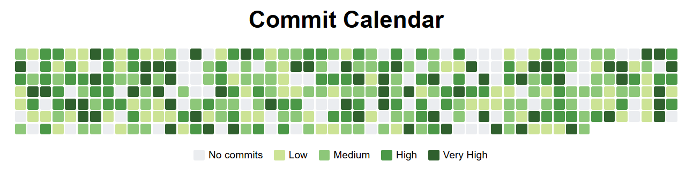

# Commit Calendar Graph

<p align="center">
    
</p>

The **Yearly Commit Calendar** is a simple visualization tool that displays a year's worth of commit activity in a calendar format. Each day is represented by a square, and the color intensity of the square reflects the level of activity for that day.

## Features
- Displays a yearly calendar with daily commit activity.
- Uses color gradients to represent different levels of commit activity:
  - **No commits**: Light gray (`#ebedf0`)
  - **Low activity**: Light green (`#c6e48b`)
  - **Medium activity**: Green (`#7bc96f`)
  - **High activity**: Dark green (`#239a3b`)
  - **Very high activity**: Darkest green (`#196127`)
- Includes a legend to explain the color coding.
- Generates random commit data for demonstration purposes.

---

## Installation

To use this project locally, follow these steps:

1. **Clone the Repository**:
   ```bash
   git clone https://github.com/Marfullsen/commit_calendar_graph.git yearly-commit-calendar
   cd yearly-commit-calendar
   ```

2. **Run with any Server**
    ```bash
    Five Server running at:
    > Network:  http://192.168.1.1:5500
    > Local:    http://localhost:5500
    ```

## Contributing

Contributions are welcome! If you'd like to improve this project, please follow these steps:

- Fork the repository.
- Create a new branch for your feature or bug fix.
- Submit a pull request with a detailed description of your changes.

## Acknowledgments
Inspired by GitHub's contribution graph.
Built with simplicity and ease of customization in mind.